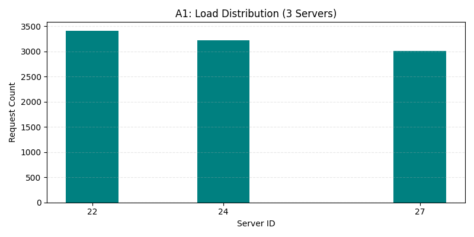
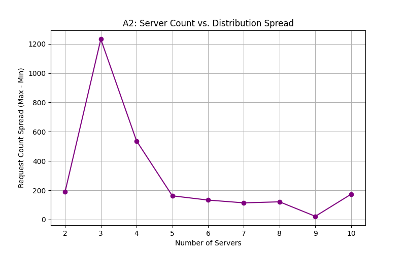
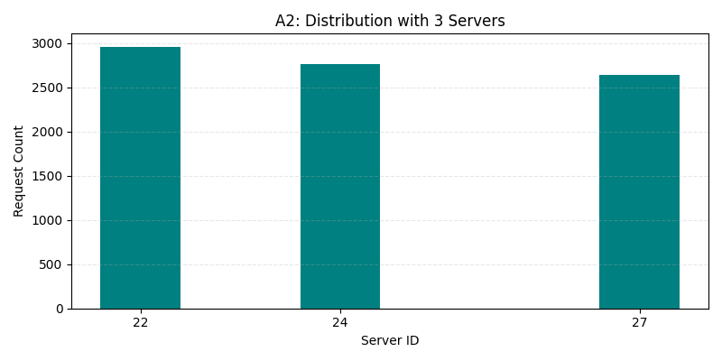
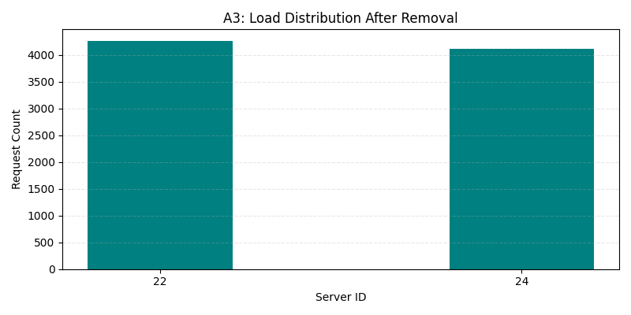

# Distributed Systems Lab 2 – Customizable Load Balancer

## Task 1: Web Server Implementation with FastAPI

This repository contains the implementation of a lightweight HTTP web server written in **FastAPI**, designed to be used in a distributed system managed by a load balancer.

---

## 🚀 Features

* **`/home` Endpoint (GET)**
  Returns a unique message indicating the identity of the server instance.

  Example Response:

  ```json
  {
    "message": "Hello from Server: 1",
    "status": "successful"
  }
  ```

* **`/heartbeat` Endpoint (GET)**
  A lightweight endpoint used by the load balancer to check server availability. Returns HTTP 200.

---

## ⚙️ Environment

* **Language**: Python 3.10
* **Framework**: FastAPI
* **Containerization**: Docker
* **Port**: 5000

---

## 🐳 Docker Instructions

### Build Image

```bash
docker build -t fastapi-server .
```

### Run Container

```bash
docker run -e SERVER_ID=1 -p 5000:5000 fastapi-server
```

This command exposes the FastAPI server on `localhost:5000`.

---

## 🛠️ Makefile Commands

| Command        | Description                         |
| -------------- | ----------------------------------- |
| `make build`   | Build the Docker image              |
| `make run`     | Run the container with SERVER\_ID=1 |
| `make stop`    | Stop and remove the container       |
| `make rebuild` | Rebuild and run again               |
| `make clean`   | Remove unused Docker images         |

---

## 📁 Project Structure

```
.
├── Dockerfile
├── Makefile
├── README.md
├── requirements.txt
├── server.py
├── load_balancer/
│   ├── main.py
│   ├── consistent_hash.py
│   └── requirements.txt
├── analysis/
│   ├── analyze_load_balancer.py
│   ├── simulate.py
│   └── plots/
│       ├── a1_baseline.png
│       ├── a2_3_servers.png
│       ├── a2_5_servers.png
│       ├── a2_7_servers.png
│       ├── a2_spread_vs_servers.png
│       ├── a3_removed_server.png
│       ├── a4_added_server.png
│       └── simulate_distribution.png
```

---

## 🔧 Design Notes

* The server ID is passed via the `SERVER_ID` environment variable during container startup.
* The app uses FastAPI for high performance and automatic OpenAPI docs (available at `/docs`).
* The server runs on port `5000` inside the container as specified in the assignment.

---

## Task 2: Consistent Hash Ring

We implemented a consistent hashing algorithm to map client requests to available servers in a deterministic and balanced way.

* Each server is represented by multiple virtual nodes.
* Servers can be added/removed dynamically with minimal remapping.

---

## Task 3: Load Balancer with FastAPI

A load balancer is implemented using FastAPI that:

* Spawns backend server containers dynamically using the Docker SDK
* Maintains server state using a consistent hash ring
* Routes incoming requests to the correct server
* Supports the following API endpoints:

  * `POST /add`: add new server(s)
  * `DELETE /rm`: remove server(s)
  * `GET /rep`: list current servers
  * `GET /<path>`: route any path to a backend server

---

## Task 4: Request Distribution and Report

An analysis script sends 1000 simulated requests to the load balancer and tracks which server responds to each request. The results are visualized using bar charts.

### 📊 Reports

Below are the visual analyses of how the consistent hashing load balancer distributed requests under different conditions:

#### A-1: Baseline Load Distribution (3 Servers)

This chart shows how 1000 requests are distributed across 3 servers using consistent hashing.


#### A-2: Load Spread vs. Number of Servers

This plot illustrates how increasing the number of servers affects the spread of requests (difference between max and min per server).


Below are the per-server distribution charts for different numbers of servers:

* 
* 
* 

#### A-3: Rebalancing After Removing a Server

This chart shows the redistribution of requests after one server is removed.


#### A-4: Rebalancing After Adding a Server

This chart shows how requests redistribute after a new server is added.


---

## 📚 References

* [FastAPI Documentation](https://fastapi.tiangolo.com/)
* [Docker Documentation](https://docs.docker.com/)

